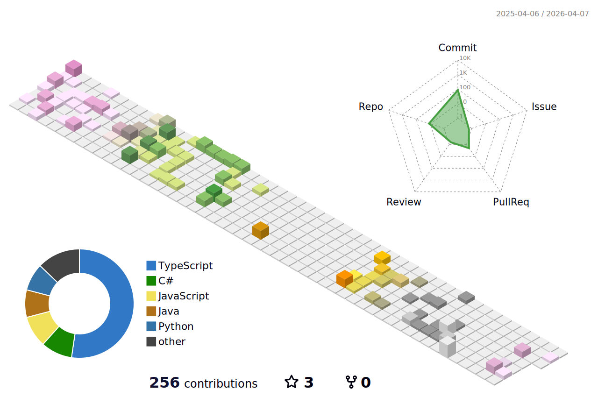

### Olá! Eu sou o Carlos Niz 🙋🏽‍♂️

---

## Tecnologias que eu estudo e uso

 
    
    
    
    
    
    

  

💻 Estudante de programação | Apaixonado por tecnologia e resolução de problemas!  
📚 Explorando linguagens e ferramentas.  
🎯 Objetivo: me tornar um desenvolvedor completo e contribuir para projetos de impacto real.

## 🪐 Contribuições

  

